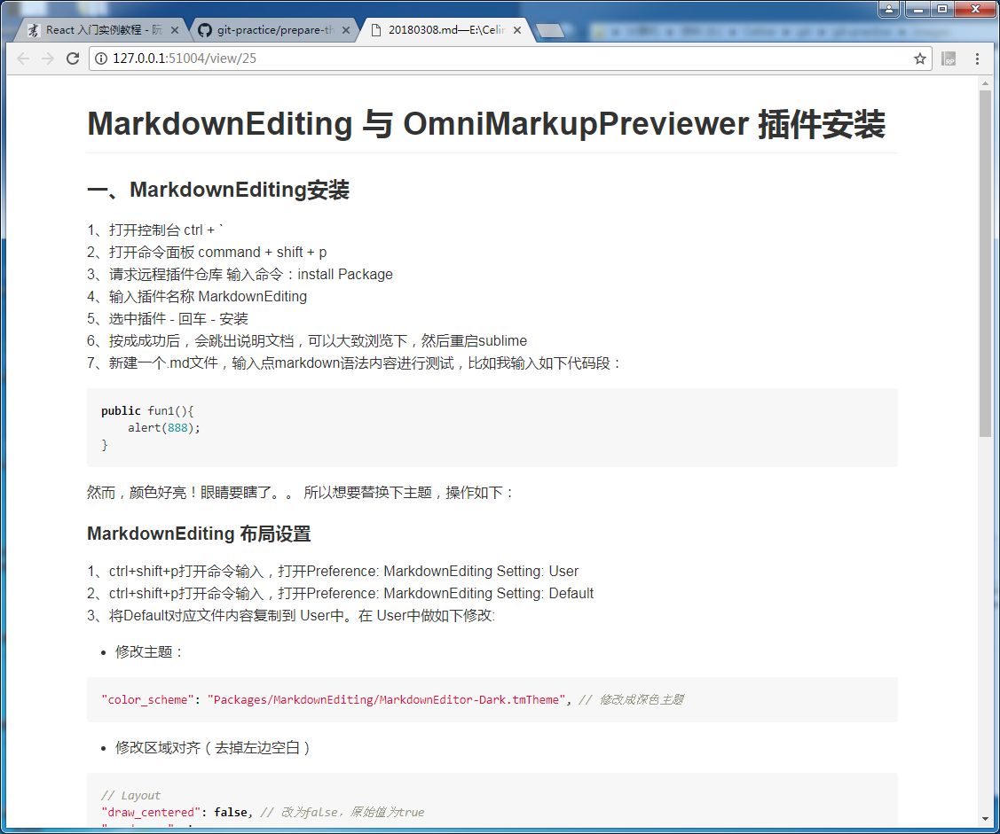

# MarkdownEditing 与 OmniMarkupPreviewer 插件安装
若要使用sublime 进行 md文件编写，可以考虑安装MarkdownEditing 与 OmniMarkupPreviewer两个插件，前者是编写界面友好化，后者是可进行浏览器浏览。  当然，你也可以玄奇其他编辑器比如atom等，希望你能找到你喜欢的编辑器，祝你好运。
### 一、MarkdownEditing安装
1、打开控制台        ctrl + `  
2、打开命令面板      command + shift + p  
3、请求远程插件仓库  输入命令：install Package  
4、输入插件名称      MarkdownEditing  
5、选中插件 - 回车 - 安装  
6、按成成功后，会跳出说明文档，可以大致浏览下，然后重启sublime  
7、新建一个.md文件，输入点markdown语法内容进行测试，比如我输入如下代码段：  

``` javascript
public fun1(){
    alert(888);
}
```
    

然而，颜色好亮！眼睛要瞎了。。
所以想要替换下主题，操作如下：
#### MarkdownEditing 布局设置
1、ctrl+shift+p打开命令输入，打开Preference: MarkdownEditing Setting: User  
2、ctrl+shift+p打开命令输入，打开Preference: MarkdownEditing Setting: Default  
3、将Default对应文件内容复制到 User中。在 User中做如下修改:  

- 修改主题：
``` javascript
"color_scheme": "Packages/MarkdownEditing/MarkdownEditor-Dark.tmTheme", // 修改成深色主题
```
    
- 修改区域对齐（去掉左边空白）
``` javascript
// Layout
"draw_centered": false, // 改为false，原始值为true
"word_wrap": true,
"wrap_width": 120, // 每行字符数上限
"rulers": [],
```

配置完毕。

### 二、OmniMarkupPreviewer安装 
和安装 MarkdownEditing 类似的步骤  
1. 打开命令面板      command + shift + p  
2. 请求远程插件仓库  输入命令：install Package   
3. 输入插件名称      OmniMarkup...  
4. 选中插件 - 回车 - 安装    
5. 按成成功后，会跳出说明文档，可以大致浏览下，尤其是快捷键（Ctrl+Alt+O，浏览器预览快捷键）    
6. 选择一个md文件进行预览，效果如下图:

